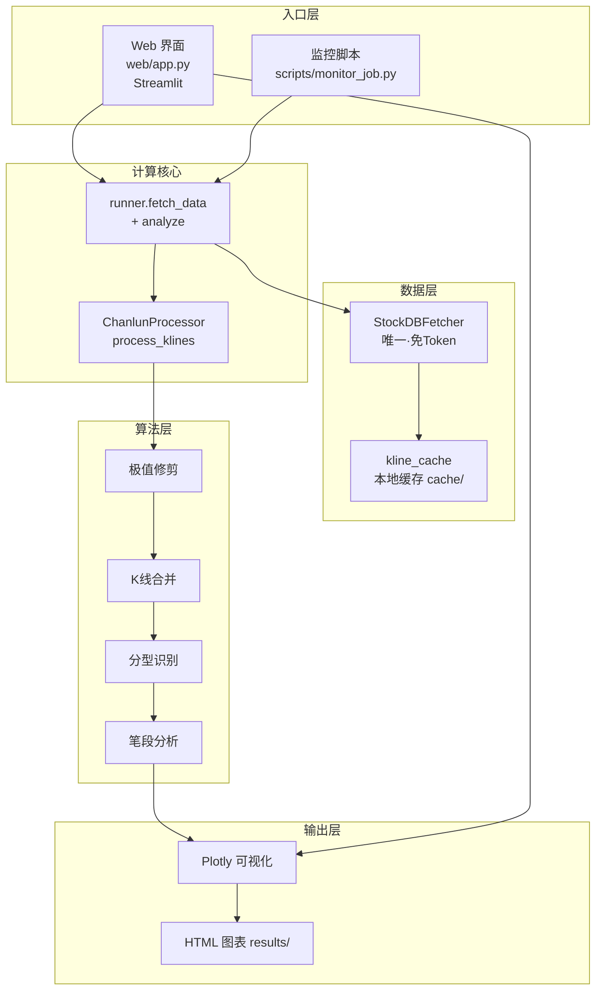
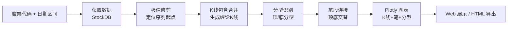

# 缠论 K 线分析工具

基于 Python 的缠论（缠中说禅）技术分析系统：从行情数据获取、K 线包含合并、分型/笔识别，到 Plotly 交互式图表与 Web 界面，提供一站式缠论研学工具。

---

## 项目功能

- **单一数据源 StockDB**
  - **StockDB**（唯一）：本地 `stockdb` 服务，免 Token、全本地、低延迟，支持 A 股 / ETF / 指数日线与分钟线前复权
  - 算法层与 UI 均只面向 StockDB，无需配置任何第三方行情 Token
- **缠论核心算法**
  - K 线包含关系处理（合并相邻包含 K 线）
  - 顶 / 底分型自动识别（多轮窗口筛选 + 关系验证）
  - 笔段分析（顶底交替连接，生成上升 / 下降笔）
- **交互式可视化**
  - Plotly 图表：日线蜡烛图 + 缠论 K 线 + 笔走势 + 分型标注 + 成交量
  - 支持拖拽缩放、Hover 详情、自适应宽度，可导出 HTML
- **入口**
  - **Web 界面**：Streamlit，参数配置 + 实时分析 + 图表展示，带登录守卫
  - **监控脚本**：`scripts/monitor_job.py` 收盘分型监控，支持命令行执行，也可在 Web 页面一键手动触发
- **工程化**
  - 统一配置（`settings.py`）、统一日志、缓存层（`kline_cache`）
  - Docker / Docker Compose 一键部署，启动自检报告环境状态

---

## 系统架构



---

## 分析流程图



---

## 项目结构

```
chanlun/
├── src/
│   ├── config/settings.py        # 集中配置（数据源、默认参数、认证开关）
│   ├── data/
│   │   ├── base_fetcher.py       # 数据获取抽象基类
│   │   ├── stockdb_fetcher.py    # StockDB 数据源（唯一）
│   │   ├── kline_cache.py        # 本地 K 线缓存
│   │   └── stock_names.py        # 股票名称映射
│   ├── core/chanlun_processor.py # 缠论核心算法
│   ├── cli/runner.py             # fetch_data + analyze 计算核心
│   ├── utils/                    # 通用工具 / 日志
│   └── visual/plotly_viz.py      # Plotly 可视化
├── web/
│   ├── app.py                    # Streamlit 主入口
│   └── styles.py                 # 样式注入
├── scripts/
│   └── monitor_job.py            # 收盘分型监控任务（命令行 / Web 手动触发）
├── start_web.bat                 # Windows 一键启动 Web + 弹窗提示
├── tests/golden_samples/         # 黄金样本（CSV + expected.json）
├── results/                      # 分析输出（HTML 图表）
├── cache/                        # 运行时 K 线缓存（自动生成）
├── Dockerfile                    # 镜像构建
├── docker-compose.yml            # 容器编排
├── .dockerignore                 # 镜像构建排除项
├── requirements.txt              # Python 依赖
└── .env.example                  # 环境变量样例
```

---

## 启动方式

### 方式一：本地 Python（开发 / 调试）

1. 安装依赖
   ```bash
   pip install -r requirements.txt
   ```
2. 配置环境变量（`.env` 或 shell 导出）
   - StockDB 为本地数据源，无需任何行情 Token
   - 公网部署建议设置 `APP_PASSWORD` 开启登录守卫
3. 启动 Web 界面
   ```bash
   streamlit run web/app.py --server.port 8501
   ```
   浏览器访问 http://localhost:8501
4. 或手动执行一次收盘监控
   ```bash
   python scripts/monitor_job.py
   ```

### 方式二：Windows 启动脚本

项目提供 `start_web.bat`，自动读取 `.env` 的 `APP_PASSWORD`、检测端口占用并启动 Web。双击或命令行运行即可。

**开机自启（Windows）**

将本项目做成开机自动运行，本质是「开机后自动执行 `start_web.bat`」。`start_web.bat` 会在后台拉起 Streamlit，并在服务就绪后**弹出提示框**告知已启动及访问地址（http://localhost:8501），无需手动看日志。

推荐两种挂载方式：

- **启动文件夹（最简单，需用户登录后触发）**
  1. `Win + R` → 输入 `shell:startup` → 回车，打开「启动」文件夹
  2. 在文件夹内**新建快捷方式**，目标指向 `start_web.bat` 的完整路径（如 `E:\privateProject\chanlun\start_web.bat`）
  3. 开机登录后即自动后台启动并弹窗提示

- **任务计划程序（可「登录前」启动，推荐常驻机器）**
  1. `taskschd.msc` → 创建基本任务
  2. 触发器选「**计算机启动时**」
  3. 操作选「启动程序」，程序填 `start_web.bat` 完整路径
  4. 勾选「**不管用户是否登录都要运行**」+「使用最高权限」
  5. ⚠️ 计划任务环境下 `PATH` 可能不含 `python`，建议把 `start_web.bat` 里的 `python` / `streamlit` 改为**绝对路径**（如 `C:\Users\你的用户名\AppData\Local\Programs\Python\Python311\python.exe`）；且「不管用户是否登录」模式下无桌面会话，**弹窗不可见**，此场景建议改用启动文件夹方案

> 说明：StockDB 为本地数据源、免 Token，开机自启无需额外配置；若 `.env` 缺少 `APP_PASSWORD`，脚本会短暂提示后自动退出（不会 `pause` 卡住自启流程）。

### 方式三：Docker（推荐部署）

> **环境说明（Windows 用户必读）**：本项目在 Windows 本机**没有安装 docker**，`docker` 命令位于 **WSL（Windows Subsystem for Linux）** 内。
> 因此请在 **WSL 终端** 中操作，并把项目路径转换为 WSL 格式：
> `E:\privateProject\chanlun` → `/mnt/e/privateProject/chanlun`。
>
> ```bash
> # 进入 WSL 并切到项目目录
> wsl
> cd /mnt/e/privateProject/chanlun
> ```

#### 服务组成

`docker-compose.yml` 定义了两个服务，注意它们的启动差异：

| 服务 | 作用 | 默认是否随 `up -d` 启动 | 端口/常驻 |
|------|------|------------------------|----------|
| `chanlun-web` | Streamlit 图形分析界面（主力） | ✅ 是（无 profiles 限制） | 8501，按需启 |
| `chanlun-cli` | 命令行交互式 shell | ❌ 否（需 `--profile cli`） | 手动进，不常驻 |

> **说明**：原「每日收盘分型监控调度器」已移除，监控改为在 Web 页面点击「🚀 立即执行收盘监控」手动触发。

#### 常用命令

```bash
# 1. 启动 Web（日常用法）
docker compose up -d

# 2. 顺带启动 CLI 交互容器（按需）
docker compose --profile cli up -d

# 3. 查看状态 / 日志
docker compose ps
docker compose logs -f chanlun-web

# 4. 停止并删除所有相关容器、网络（保留 state/cache/results 挂载卷，数据不丢）
docker compose down --remove-orphans

# 5. 停止并删除 + 重新无缓存构建镜像 + 重启（改了代码后生效）
docker compose down --remove-orphans
docker compose build --no-cache
docker compose up -d
```

> ⚠️ `down` 默认**不删命名卷**（`state`/`cache`/`results` 挂载卷会保留，监控分型快照和 K 线缓存不丢）。
> 一般不要加 `-v`，否则会丢失监控快照与缓存、导致重复推送/重复取数。
> 如需连卷一起清，才用 `docker compose down -v`（慎用）。

#### 收盘监控配置（手动触发）

在 Web 页面点击「🚀 立即执行收盘监控」即可手动触发一次 `scripts/monitor_job.py`
（也可命令行执行 `python scripts/monitor_job.py`）。相关环境变量：

| 环境变量 | 说明 | 默认 |
|---------|------|------|
| `MONITOR_CODES` | 监控标的，逗号分隔（如 `600519.SH,000001.SZ,513050.SH`） | 空（不监控） |
| `NOTIFY_CHANNEL` | 通知渠道：`none` / `feishu` / `wecom` | `none` |
| `NOTIFY_LOOKBACK_DAYS` | 回看 K 线天数（分型判断窗口） | `120` |
| `FEISHU_WEBHOOK` / `FEISHU_SECRET` | 飞书机器人配置 | 空 |
| `WECOM_WEBHOOK` | 企业微信机器人配置 | 空 |

#### 其它说明

- 容器通过 `environment:` 从宿主机 `.env` 读取配置，**镜像本身不含任何密钥**
- `results/`、`state/`、`cache/` 均挂载到宿主机，便于查看 HTML 图表、持久化分型快照与 K 线缓存
- 启动后 Web 侧栏会显示「运行环境自检」：认证状态、当前数据源

---

## 配置说明

### 环境变量（`.env`）

| 变量名 | 必填 | 说明 |
|--------|------|------|
| `APP_PASSWORD` | 否** | Web 登录口令；`AUTH_ENABLED=true` 时未配置将拒绝启动 |
| `APP_PASSWORD_HASH` | 否 | `sha256(口令)` 十六进制，替代明文更安全 |
| `AUTH_ENABLED` | 否 | 登录守卫开关（默认 `true`）；内网可设 `false` 关闭 |
| `CHANLUN_LOG_LEVEL` | 否 | 日志级别（默认 `INFO`） |

> \* 数据源为本地 StockDB，无需任何行情 Token。
> \** 公网部署务必设置 `APP_PASSWORD`，否则服务拒绝启动（fail-fast）。

### 关键配置（`src/config/settings.py`）

| 配置项 | 默认值 | 说明 |
|--------|--------|------|
| `DEFAULT_PARAMS["data_source"]` | `"stockdb"` | 唯一数据源 |
| `DATA_SOURCES` | `{"stockdb"}` | 数据源集合（仅 StockDB） |
| `CACHE_TTL` | 3600 | 数据缓存时间（秒） |
| `CHART_HEIGHT` | 800 | 图表高度（像素） |
| `DEFAULT_CODE` | `"600000"` | 默认股票代码 |

---

## 股票代码格式

| 市场类型 | 代码格式 | 示例 |
|---------|---------|------|
| A股（沪市） | `XXXXXX.SH` | `600000.SH` 浦发银行 |
| A股（深市） | `XXXXXX.SZ` | `000001.SZ` 平安银行 |
| ETF（沪市） | `5XXXXX.SH` | `510300.SH` 沪深300ETF |
| ETF（深市） | `159XXX.SZ` | `159915.SZ` 创业板ETF |
| 指数（上证） | `000XXX.SH` | `000300.SH` 沪深300指数 |
| 旧前缀兼容 | `sh.XXXXXX` | 自动转换为 `XXXXXX.SH` |

> 港股暂不支持（会主动提示）；分钟线由 StockDB 支持。

---

## 常见问题

**Q1：Web 提示「未配置 APP_PASSWORD，服务拒绝启动」**
公网部署需设置 `APP_PASSWORD`（或 `APP_PASSWORD_HASH`）；本地/内网可在 `.env` 设 `AUTH_ENABLED=false` 关闭守卫。

**Q2：取数失败 / 提示 StockDB 不可用**
确认本地 `stockdb` 服务已启动（默认 `D:\stockdb\stockdb.exe`），且 `STOCKDB_SDK_PATH` 指向包含 `stockdb.pyd` / `stock_sdk.py` 的目录。

**Q3：图表 K 线比原始数据少**
这是缠论算法正常行为：`极值修剪` 丢弃历史最高/最低点之前的区间，`K 线合并` 合并包含关系，两者都会减少显示根数。

**Q4：图表数据与行情软件不完全一致**
数据来自本地 StockDB（前复权口径），差异主要来自停牌日处理与复权基准日不同。

**Q5：开机自启后没看到「已启动」弹窗 / 服务没起来**
- 若用任务计划程序且勾选了「不管用户是否登录都要运行」：**该模式无桌面会话，弹窗本就不可见**，属正常；服务仍会后台运行，直接访问 http://localhost:8501 即可。需要看弹窗请改用「启动文件夹」方案。
- 检查 `python` / `streamlit` 是否在计划任务的 `PATH` 中，建议在 `start_web.bat` 内写为绝对路径。
- 若 `.env` 缺少 `APP_PASSWORD` 且 `AUTH_ENABLED=true`，脚本会提示后退出（Web 不启动），请在 `.env` 配置口令或设 `AUTH_ENABLED=false`。

---

## 单标的 AI 深度分析（悬浮按钮）

Web 单标的分析页右下角提供一个常驻的「🤖 AI 深度分析」**悬浮按钮（FAB）**：

- **用法**：先在左侧点「🚀 开始分析」取得数据（既有流程不变），再点右下角悬浮按钮，
  即可把已分析的 `result` / `summary` 直接交给大模型研判，并在「🤖 AI 深度研判」折叠区
  展示结论（可信性 / 风险点 / 操作建议 / 需人工复核项）。**每次点击实时调用 AI，不缓存。**
- **引导逻辑（防止功能不可见）**：
  - AI 未开启 → 点击按钮提示如何配置 `.env`（见下）；
  - 尚未分析 → 点击按钮提示「请先开始分析」。
- **研判对象标注**：结果区始终标注标的、区间与周期（日线 / 分钟线），
  避免「改了参数还没重析」时的误判。
- **降级优先**：AI 调用失败仅提示 warning，原缠论图 / 蜡烛图 / 监控完全不受影响。
- **上下文增强**：发送给模型的内容以「最新分型」为起点的 K 线窗口（含量价），并内嵌标的的
  **个股日资金流**（`flow`：主力/超大/大/中/小单净流入及买卖额，本地 stockdb 提供，**默认必须发送、
  无开关**；仅查「最新分型当日及其之后」的交易日，取数失败自动跳过不影响研判），
  辅助模型判断分型确认时资金是否配合。
- **分型精简**：只发送最近 **2 个**分型（`fractals[-2:]`），每个含其 `datetime` 生成时间。
- **状态与耗时**：弹窗内完整展示「组装 → 已发送 → **分析完成，耗时 Xs**」，
  分析用时实时显示，不再停留在「等待模型返回」。
- **日志（cmd 可见 + 前端可查）**：AI 全流程日志会**打印到 `start_web.bat` 所在的 cmd 窗口**，
  同时进入应用日志（「日志」视图新增 `AI` 组件可筛选）。关键节点：
  `开始组装 AI payload` → `资金流开始获取` → `资金流获取成功(交易日数)`
  或 `资金流获取失败或为空`(仅 WARN，不影响研判) → `开始请求 AI`(含 model/超时/payload 字符数)
  → `AI 调用成功`(含耗时) 或失败告警。

### 配置（凭据全部来自 `.env`，绝不硬编码）

```dotenv
AI_ENABLED=true
AI_BASE_URL=https://<你的OpenAI兼容端点>/v1   # 本地 Ollama 填 http://host.docker.internal:11434/v1
AI_MODEL=auto
AI_API_KEY=<从服务商获取，绝不入库/不打印>
AI_TIMEOUT=60
AI_MAX_TOKENS=4000
AI_MAX_RETRY=1
AI_KLINE_WINDOW=30
# 以下均无环境变量开关：
#   - 个股日资金流：默认必须发送
#   - 基本面：本项目不做基本面研判（配置已移除）
#   - temperature：代码中固定 0.2，保证技术分析结论稳定可复现
```

未配置 `AI_ENABLED=true` 时，悬浮按钮仍可见可点，仅给出配置指引，不影响其他分析功能。

### 发送给 AI 的完整内容

一次请求是「**系统提示词 + 用户消息 + 请求参数**」三件套，弹窗里看到的 JSON 只是用户消息的数据部分：

- **系统提示词**：缠论助手角色定位、数据含义说明、**防幻觉三条铁律**（仅基于所给数据、
  不得编造基本面/宏观/新闻、数据不足须如实说明）、以及输出 JSON 的字段 schema。
- **用户消息**：一句自然语言任务引导 + 上面的 JSON 数据（不能只丢 JSON，弱模型需要明确指令）。
- **请求参数**：`response_format=json_object`（强制 JSON 输出）、`temperature=0.2`、
  `max_tokens`、`timeout`。

此外 payload 的 `context` 还带 `market_note`（市场语境）与 `field_glossary`
（字段词典：顶/底分型、上升/下降笔、成交量单位=股、成交额单位=元、资金流各子字段），
让模型不必猜测字段语义。模型会先锁定最值得关注的分型并填入 `focus_fractal`
（生成时间 + 类型 + 理由），界面上以「🎯 模型关注的分型」卡片展示。

---

## 免责声明

本工具仅为缠论算法学习与研究的工程化尝试，不构成任何投资建议。投资有风险，入市需谨慎。
