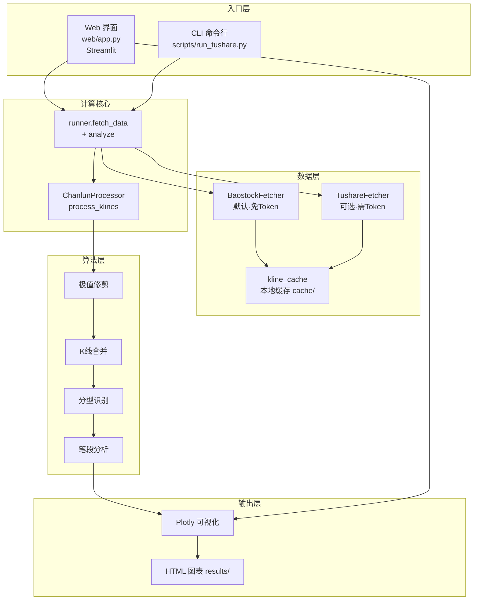

# 缠论 K 线分析工具

基于 Python 的缠论（缠中说禅）技术分析系统：从行情数据获取、K 线包含合并、分型/笔识别，到 Plotly 交互式图表与 Web 界面，提供一站式缠论研学工具。

---

## 项目功能

- **多数据源**
  - **Baostock**（默认）：免费、免 Token，支持 A 股 / ETF 日线前复权数据，开箱即用
  - **Tushare**（可选）：需配置 `TUSHARE_TOKEN`，经官方接口或私有代理取数；支持 A 股 / ETF / 指数日线
  - 前端可下拉切换数据源，算法层对两种数据源透明
- **缠论核心算法**
  - K 线包含关系处理（合并相邻包含 K 线）
  - 顶 / 底分型自动识别（多轮窗口筛选 + 关系验证）
  - 笔段分析（顶底交替连接，生成上升 / 下降笔）
- **交互式可视化**
  - Plotly 图表：日线蜡烛图 + 缠论 K 线 + 笔走势 + 分型标注 + 成交量
  - 支持拖拽缩放、Hover 详情、自适应宽度，可导出 HTML
- **双入口**
  - **Web 界面**（推荐）：Streamlit，参数配置 + 实时分析 + 图表展示，带登录守卫
  - **CLI 命令行**：交互式参数输入，自动保存 HTML 图表到 `results/`
- **工程化**
  - 统一配置（`settings.py`）、统一日志、缓存层（`kline_cache`）
  - Docker / Docker Compose 一键部署，启动自检报告环境状态

---

## 系统架构



---

## 分析流程图


---

## 项目结构

```
chanlun/
├── src/
│   ├── config/settings.py        # 集中配置（数据源、默认参数、认证开关）
│   ├── data/
│   │   ├── base_fetcher.py       # 数据获取抽象基类
│   │   ├── baostock_fetcher.py   # Baostock 数据源（默认）
│   │   ├── tushare_fetcher.py    # Tushare 数据源（可选）
│   │   ├── kline_cache.py        # 本地 K 线缓存
│   │   └── stock_names.py        # 股票名称映射
│   ├── core/chanlun_processor.py # 缠论核心算法
│   ├── cli/runner.py             # fetch_data + analyze 计算核心
│   ├── utils/                    # 通用工具 / 日志
│   └── visual/plotly_viz.py      # Plotly 可视化
├── web/
│   ├── app.py                    # Streamlit 主入口
│   └── styles.py                 # 样式注入
├── scripts/
│   ├── run_tushare.py            # CLI 交互式入口
│   └── monitor_job.py            # 定时监控任务
├── tests/golden_samples/         # 黄金样本（CSV + expected.json）
├── results/                      # 分析输出（HTML 图表）
├── cache/                        # 运行时 K 线缓存（自动生成）
├── Dockerfile                    # 镜像构建
├── docker-compose.yml            # 容器编排
├── .dockerignore                 # 镜像构建排除项
├── requirements.txt              # Python 依赖
└── .env.example                  # 环境变量样例
```

---

## 启动方式

### 方式一：本地 Python（开发 / 调试）

1. 安装依赖
   ```bash
   pip install -r requirements.txt
   ```
2. 配置环境变量（`.env` 或 shell 导出）
   - Baostock 免配置，直接可用
   - 选用 Tushare 需设置 `TUSHARE_TOKEN`
   - 公网部署建议设置 `APP_PASSWORD` 开启登录守卫
3. 启动 Web 界面
   ```bash
   streamlit run web/app.py --server.port 8501
   ```
   浏览器访问 http://localhost:8501
4. 或使用 CLI
   ```bash
   python scripts/run_tushare.py
   ```

### 方式二：Windows 启动脚本

项目提供 `start_web.bat`，自动读取 `.env` 的 `APP_PASSWORD`、检测端口占用并启动 Web。双击或命令行运行即可。

**开机自启（Windows）**

将本项目做成开机自动运行，本质是「开机后自动执行 `start_web.bat`」。`start_web.bat` 会在后台拉起 Streamlit，并在服务就绪后**弹出提示框**告知已启动及访问地址（http://localhost:8501），无需手动看日志。

推荐两种挂载方式：

- **启动文件夹（最简单，需用户登录后触发）**
  1. `Win + R` → 输入 `shell:startup` → 回车，打开「启动」文件夹
  2. 在文件夹内**新建快捷方式**，目标指向 `start_web.bat` 的完整路径（如 `E:\privateProject\chanlun\start_web.bat`）
  3. 开机登录后即自动后台启动并弹窗提示

- **任务计划程序（可「登录前」启动，推荐常驻机器）**
  1. `taskschd.msc` → 创建基本任务
  2. 触发器选「**计算机启动时**」
  3. 操作选「启动程序」，程序填 `start_web.bat` 完整路径
  4. 勾选「**不管用户是否登录都要运行**」+「使用最高权限」
  5. ⚠️ 计划任务环境下 `PATH` 可能不含 `python`，建议把 `start_web.bat` 里的 `python` / `streamlit` 改为**绝对路径**（如 `C:\Users\你的用户名\AppData\Local\Programs\Python\Python311\python.exe`）；且「不管用户是否登录」模式下无桌面会话，**弹窗不可见**，此场景建议改用启动文件夹方案

> 说明：Baostock 默认数据源免 Token，开机自启无需额外配置；若 `.env` 缺少 `APP_PASSWORD`，脚本会短暂提示后自动退出（不会 `pause` 卡住自启流程）。

### 方式三：Docker（推荐部署）

```bash
# 默认启动 Web 服务（端口 8501）
docker compose up -d

# 如需 CLI 交互式容器（按需）
docker compose --profile cli up -d
```

- 容器通过 `environment:` 从宿主机 `.env` 读取配置，**镜像本身不含任何密钥**
- `results/` 挂载到宿主机，便于查看生成的 HTML 图表
- 启动后 Web 侧栏会显示「运行环境自检」：认证状态、默认数据源、Tushare 是否就绪

---

## 配置说明

### 环境变量（`.env`）

| 变量名 | 必填 | 说明 |
|--------|------|------|
| `TUSHARE_TOKEN` | 否* | Tushare API Token；仅选用 Tushare 数据源时需要（Baostock 免 Token） |
| `TUSHARE_API_URL` | 否 | Tushare 接口地址（默认官方，可改私有代理） |
| `APP_PASSWORD` | 否** | Web 登录口令；`AUTH_ENABLED=true` 时未配置将拒绝启动 |
| `APP_PASSWORD_HASH` | 否 | `sha256(口令)` 十六进制，替代明文更安全 |
| `AUTH_ENABLED` | 否 | 登录守卫开关（默认 `true`）；内网可设 `false` 关闭 |
| `CHANLUN_LOG_LEVEL` | 否 | 日志级别（默认 `INFO`） |

> \* 默认数据源为 Baostock，纯 Baostock 使用场景无需任何 Token。
> \** 公网部署务必设置 `APP_PASSWORD`，否则服务拒绝启动（fail-fast）。

### 关键配置（`src/config/settings.py`）

| 配置项 | 默认值 | 说明 |
|--------|--------|------|
| `DEFAULT_PARAMS["data_source"]` | `"baostock"` | 默认数据源 |
| `DATA_SOURCES` | `{"baostock", "tushare"}` | 可选数据源集合 |
| `CACHE_TTL` | 3600 | 数据缓存时间（秒） |
| `CHART_HEIGHT` | 800 | 图表高度（像素） |
| `DEFAULT_CODE` | `"600000"` | 默认股票代码 |

---

## 股票代码格式

| 市场类型 | 代码格式 | 示例 |
|---------|---------|------|
| A股（沪市） | `XXXXXX.SH` | `600000.SH` 浦发银行 |
| A股（深市） | `XXXXXX.SZ` | `000001.SZ` 平安银行 |
| ETF（沪市） | `5XXXXX.SH` | `510300.SH` 沪深300ETF |
| ETF（深市） | `159XXX.SZ` | `159915.SZ` 创业板ETF |
| 指数（上证） | `000XXX.SH` | `000300.SH` 沪深300指数 |
| 旧前缀兼容 | `sh.XXXXXX` | 自动转换为 `XXXXXX.SH` |

> 港股 / 分钟线暂不支持，选用时会主动提示。

---

## 常见问题

**Q1：Web 提示「未配置 APP_PASSWORD，服务拒绝启动」**
公网部署需设置 `APP_PASSWORD`（或 `APP_PASSWORD_HASH`）；本地/内网可在 `.env` 设 `AUTH_ENABLED=false` 关闭守卫。

**Q2：选 Tushare 提示取数失败**
确认已配置 `TUSHARE_TOKEN`；若走私有代理，确认 `TUSHARE_API_URL` 正确且该代理支持 `daily` 接口。

**Q3：图表 K 线比原始数据少**
这是缠论算法正常行为：`极值修剪` 丢弃历史最高/最低点之前的区间，`K 线合并` 合并包含关系，两者都会减少显示根数。

**Q4：切换数据源后结果不一致**
两源复权口径一致（均按最新交易日基准前复权），差异主要来自停牌日处理（Tushare `daily` 不返回停牌日）。

**Q5：开机自启后没看到「已启动」弹窗 / 服务没起来**
- 若用任务计划程序且勾选了「不管用户是否登录都要运行」：**该模式无桌面会话，弹窗本就不可见**，属正常；服务仍会后台运行，直接访问 http://localhost:8501 即可。需要看弹窗请改用「启动文件夹」方案。
- 检查 `python` / `streamlit` 是否在计划任务的 `PATH` 中，建议在 `start_web.bat` 内写为绝对路径。
- 若 `.env` 缺少 `APP_PASSWORD` 且 `AUTH_ENABLED=true`，脚本会提示后退出（Web 不启动），请在 `.env` 配置口令或设 `AUTH_ENABLED=false`。

---

## 免责声明

本工具仅为缠论算法学习与研究的工程化尝试，不构成任何投资建议。投资有风险，入市需谨慎。
