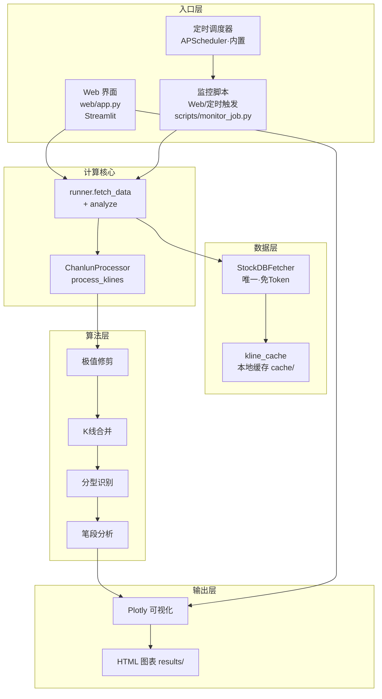
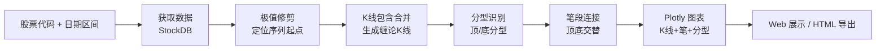

# 缠论 K 线分析工具

基于 Python 的缠论（缠中说禅）技术分析系统：从行情数据获取、K 线包含合并、分型/笔识别，到 Plotly 交互式图表与 Web 界面，提供一站式缠论研学工具。

---

## 项目功能

- **单一数据源 StockDB**：本地 `stockdb` 服务（源自 [free-stockdb](https://github.com/hello245m/free-stockdb) 项目），免 Token、全本地、低延迟，支持 A 股 / ETF / 指数日线与分钟线前复权；算法层与 UI 均只面向 StockDB，无需配置任何第三方行情 Token。
- **缠论核心算法**：K 线包含关系合并、顶/底分型自动识别（多轮窗口筛选 + 关系验证）、笔段分析（顶底交替连接，生成上升 / 下降笔）。
- **交互式可视化**：Plotly 日线蜡烛图 + 缠论 K 线 + 笔走势 + 分型标注 + 成交量；支持拖拽缩放、Hover 详情、自适应宽度，可导出 HTML。
- **多入口**：
  - Web 界面（Streamlit）：参数配置 + 实时分析 + 图表展示，带登录守卫。
  - 收盘分型监控（`scripts/monitor_job.py`）：命令行执行或 Web 一键手动触发；可选**内置定时调度**（APScheduler，由 `.env` 控制，非交易日自动跳过）；支持飞书 / 企业微信推送。
- **单标的 AI 深度分析**：Web 悬浮按钮调用大模型对当前分型研判（可信性 / 风险点 / 操作建议），内嵌个股日资金流辅助判断；凭据全部来自 `.env`，不缓存。
- **工程化**：集中配置、统一日志、本地缓存层，Docker 一键部署，启动自检环境状态。

---

## 系统架构



---

## 分析流程



---

## 项目结构

```
chanlun/
├── src/
│   ├── config/settings.py        # 集中配置（数据源、默认参数、认证开关）
│   ├── data/
│   │   ├── base_fetcher.py       # 数据获取抽象基类
│   │   ├── stockdb_fetcher.py    # StockDB 数据源（唯一）
│   │   ├── kline_cache.py        # 本地 K 线缓存
│   │   └── stock_names.py        # 股票名称映射
│   ├── core/chanlun_processor.py # 缠论核心算法
│   ├── cli/runner.py             # fetch_data + analyze 计算核心
│   ├── utils/                    # 通用工具 / 日志
│   └── visual/plotly_viz.py      # Plotly 可视化
├── web/
│   ├── app.py                    # Streamlit 主入口
│   └── styles.py                 # 样式注入
├── scripts/
│   └── monitor_job.py            # 收盘分型监控任务（命令行 / Web 手动触发）
├── start_web.bat                 # Windows 一键启动 Web
├── Dockerfile / docker-compose.yml / .dockerignore
├── requirements.txt              # Python 依赖
└── .env.example                  # 环境变量样例
```

---

## 快速开始

### 本地运行

```bash
pip install -r requirements.txt
streamlit run web/app.py --server.port 8501
```

浏览器访问 http://localhost:8501 。StockDB 为本地数据源（源自 [free-stockdb](https://github.com/hello245m/free-stockdb) 项目），无需任何行情 Token；使用前确认本地 `stockdb` 服务已启动（默认 `D:\stockdb\stockdb.exe`）。

### Windows 一键启动

双击 `start_web.bat` 即可自动读取 `.env`、检测端口并启动 Web。

### Docker 部署

```bash
docker compose up -d                    # 启动 Web（端口 8501）
docker compose --profile cli up -d      # 可选：命令行交互容器
```

容器从宿主机 `.env` 读取配置，镜像本身不含任何密钥；`results/`、`state/`、`cache/` 挂载到宿主机持久化。

---

## 配置说明

### 环境变量（`.env`）

| 变量名 | 必填 | 说明 |
|--------|------|------|
| `APP_PASSWORD` | 否* | Web 登录口令；`AUTH_ENABLED=true` 时未配置将拒绝启动 |
| `APP_PASSWORD_HASH` | 否 | `sha256(口令)` 十六进制，替代明文更安全 |
| `AUTH_ENABLED` | 否 | 登录守卫开关（默认 `true`）；内网可设 `false` 关闭 |
| `CHANLUN_LOG_LEVEL` | 否 | 日志级别（默认 `INFO`） |

> * 数据源为本地 StockDB，无需任何行情 Token；公网部署务必设置 `APP_PASSWORD`。

### 收盘监控与通知

| 环境变量 | 说明 | 默认 |
|---------|------|------|
| `MONITOR_CODES` | 监控标的，逗号分隔（如 `600519.SH,000001.SZ,513050.SH`） | 空（不监控） |
| `NOTIFY_CHANNEL` | 通知渠道：`none` / `feishu` / `wecom` | `none` |
| `NOTIFY_LOOKBACK_DAYS` | 回看 K 线天数（分型判断窗口） | `120` |
| `FEISHU_WEBHOOK` / `FEISHU_SECRET` | 飞书机器人配置 | 空 |
| `WECOM_WEBHOOK` | 企业微信机器人配置 | 空 |

### 定时调度（可选）

可由程序自身按交易日盘后周期性触发收盘监控，无需外部 crontab / 任务计划程序：

| 环境变量 | 说明 | 默认 |
|---------|------|------|
| `MONITOR_SCHEDULE_ENABLED` | 是否启用内置定时（`true` 开启） | `false` |
| `MONITOR_SCHEDULE_HOUR` | 触发小时（机器本地时区） | `15` |
| `MONITOR_SCHEDULE_MINUTE` | 触发分钟 | `30` |
| `MONITOR_SCHEDULE_DAYS` | 触发星期（APScheduler 表达式，如 `mon-fri` / `*` / `sun`） | `mon-fri` |

- 调度随 Web 进程启动（也可 `python -m src.scheduler` 作为独立进程前台常驻）。
- `run_monitor(force=False)` 自身会在非交易日跳过，节假日不会误推。

### 单标的 AI 深度分析

| 环境变量 | 说明 |
|---------|------|
| `AI_ENABLED` | 是否启用（默认 `false`，未开启时按钮仅给配置指引） |
| `AI_BASE_URL` | OpenAI 兼容端点（含 `/v1`） |
| `AI_MODEL` | 模型名 |
| `AI_API_KEY` | 凭据（仅 `.env`，绝不入库 / 不打印） |
| `AI_TIMEOUT` / `AI_MAX_TOKENS` / `AI_MAX_RETRY` / `AI_KLINE_WINDOW` | 超时 / 输出长度 / 重试 / K 线窗口 |

---

## 股票代码格式

| 市场类型 | 代码格式 | 示例 |
|---------|---------|------|
| A股（沪市） | `XXXXXX.SH` | `600000.SH` 浦发银行 |
| A股（深市） | `XXXXXX.SZ` | `000001.SZ` 平安银行 |
| ETF（沪市） | `5XXXXX.SH` | `510300.SH` 沪深300ETF |
| ETF（深市） | `159XXX.SZ` | `159915.SZ` 创业板ETF |
| 指数（上证） | `000XXX.SH` | `000300.SH` 沪深300指数 |
| 旧前缀兼容 | `sh.XXXXXX` | 自动转换为 `XXXXXX.SH` |

> 港股暂不支持（会主动提示）；分钟线由 StockDB 支持。

---

## 免责声明

本工具仅为缠论算法学习与研究的工程化尝试，不构成任何投资建议。投资有风险，入市需谨慎。
